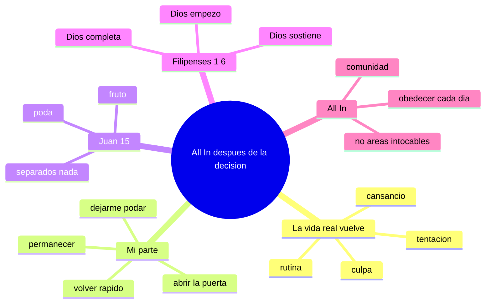

## (1/10) Post-campa
### “Tomé una decisión por Cristo… ¿y ahora qué?”

All In: **permanecer hoy**, confiando en que **Dios completa** lo que empezó.

#### Imagen IA
Cinematic photorealistic still frame, grounded and intimate, soft natural morning light, 35mm lens look, shallow depth of field, gentle bokeh, subtle film grain, calm contemplative mood, restrained color palette (warm highlights + cool shadows), documentary-cinema color grade, 16:9, no text.

---

## (2/10) Columna vertebral

### Idea central
Jesús me manda a **permanecer** (Juan 15) y Dios me promete que **Él lleva adelante el proceso** hasta terminar su obra (Filipenses 1:6).  
All In se ve así: **rendir el control** y **permanecer**, confiando en que **Dios completa** lo que empezó.

### Textos base
- **Juan 15:4–5**
- **Filipenses 1:6**
- Apoyo: **Lucas 9:23**

### Analogía visual central (guía del storytelling, no decirla explícitamente)
Un **viñedo** a lo largo de una temporada: rama unida a la vid, Padre que poda, proceso hasta la cosecha.

---

## (3/10) Mapa conceptual (Mermaid)

---

## (4/10) Introducción (inductiva)
### Lo que nadie te avisa del “después”

Hay un momento en el que te das cuenta: la vida volvió.  
Y capaz te pegó alguna de estas:
- “No siento lo mismo que sentía.”
- “Estoy cansado, me distraigo, me enfrío.”
- “Volví a caer en lo de siempre.”
- “Me da vergüenza mirar a Dios.”

Y entonces aparece la pregunta: **tomé una decisión por Cristo… ¿y ahora qué?**

Hoy no quiero repetir experiencias; quiero darte **dos columnas** para sostener tu fe cuando pasa la emoción:  
un **mandato** de Jesús (Juan 15) y una **promesa** de Dios (Filipenses 1:6).

Y antes de eso, mi parte en una frase:
Jesús **no fuerza** a nadie. Él llama, invita, espera. Está a la puerta y golpea, pero **solo entra si le abrimos** (Apocalipsis 3:20).  
Permanecer no empieza con “hacer más”, empieza con **dejarlo entrar** y volver a abrirle cada día.

#### Imagen IA
Una escena al amanecer de regreso a la rutina: un joven caminando por un camino entre hileras de viñedos, luz fría de mañana, cansancio pero esperanza; al costado, una pequeña puerta de madera entreabierta con luz cálida saliendo desde adentro (invitación, no fuerza). Estilo cinematográfico realista, 16:9, sin texto.

---

## (5/10) Juan 15
### “Permanezcan en mí” (no es religión, es conexión)

Jesús no dice “acuérdense de mí” o “visítenme de vez en cuando”. Dice: **permanezcan**.

La imagen es simple: **vid y ramas**.
- La rama no “se esfuerza” para tener vida: **se mantiene unida** a la vid.
- El fruto no sale de la presión: sale de la **permanencia**.

> “Separados de mí, **nada** pueden hacer.” (Juan 15:5)

No dice “poco”. Dice **nada**.  
El peligro del después es este: querer volver a producir sin volver a **permanecer**.

Aplicación (bien concreto):
- oración honesta (volver a hablar con Él)
- Palabra diaria (aunque sea poco)
- obediencia cuando cuesta (relación, no performance)

#### Imagen IA
Primer plano de una rama unida a la vid, hojas vivas, luz cálida, textura detallada, shallow depth of field, estilo fotográfico realista, 16:9, sin texto.

---

## (6/10) Juan 15
### La poda (el dolor que forma fruto)

En Juan 15 aparece algo que a veces confundimos: **la poda**.  
El Padre poda para que haya más fruto. No todo lo que duele es castigo; a veces es Dios formando carácter, limpiando motivaciones, acomodando prioridades.

Mi rol es activo, pero distinto:
- no es “yo me arreglo”
- es **yo me dejo trabajar**

¿Cuánto hay que dejarse podar? ¿Cuánto dar?  
La respuesta de un corazón **All In** es: **todo**.

No para ganarme su amor, sino porque **ya soy de Él** y confío en que su mano es buena.  
All In es decirle: “Señor, no hay áreas intocables”.

#### Imagen IA
Mano de jardinero con tijeras de poda, cortes limpios en una vid, luz cálida, sensación de cuidado y precisión, estilo cinematográfico realista, 16:9, sin texto.

---

## (7/10) Juan 15
### Ilustraciones: si no hay poda (y por qué el dolor sirve)

Si no hay poda (ejemplos negativos):
- En un viñedo, puede haber más ramas y hojas, pero termina con **menos fruto**, más enredo y más sombra.
- En un árbol, si no se corrige a tiempo, crecen ramas torcidas y se forman **nudos**: después queda más frágil y marcado.

Cuando la poda duele pero mejora (ejemplos positivos):
- Podar un árbol joven puede evitar nudos y deformaciones: el corte hoy, firmeza mañana.
- Sacar brotes de más permite que la savia vaya a lo importante: menos exhibición, más fruto.

#### Imagen IA (contraste)
Pantalla dividida en dos escenas del mismo viñedo: izquierda sin podar (enredado, exceso de hojas, racimos escasos), derecha podado (líneas limpias, racimos sanos, luz entrando). Estilo cinematográfico realista, 16:9, sin texto.

#### Imagen IA (árbol y nudos)
Árbol joven recién podado con guía de crecimiento; en segundo plano una sección de madera con nudos marcados por ramas mal dirigidas. Estilo fotográfico realista, 16:9, sin texto.

---

## (8/10) Filipenses 1:6
### “El que comenzó… la perfeccionará”

> “El que comenzó en ustedes la buena obra, la perfeccionará…” (Filipenses 1:6)

Fijate el sujeto: **Dios**.
- Él **comenzó** la obra
- Él **sostiene** la obra
- Él **completa** la obra

Esto no es un proyecto de auto-mejora espiritual.  
Es Dios siendo Dios en tu proceso.

Y eso te salva de dos extremos:
- orgullo (“yo puedo solo”)
- desesperación (“ya está, arruiné todo”)

#### Imagen IA
Viñedo en transición de estaciones (time-lapse en una sola imagen): invierno podado, primavera brotes, verano racimos; un jardinero al fondo supervisando. Estilo cinematográfico, 16:9, sin texto.

---

## (9/10) Filipenses 1:6
### Identidad, vuelta y molde

> Dios te llama por tu nombre aunque conoce tu pecado,  
> pero el diablo te llama por tu pecado aunque conozca tu nombre.

El enemigo quiere que tu caída sea tu identidad. Jesús quiere que tu caída sea un lugar de **vuelta**.  
Si alguna vez te sentís como Pedro después de negar a Jesús, el punto no es esconderte: es **volver**.

Y si te ayuda otra imagen: no solo hay Jardinero. También hay **Alfarero**.  
La pregunta no es “¿cuánta fuerza tengo para cambiar?”, sino “¿me dejo moldear o me resisto?”

#### Imagen IA (Alfarero)
Manos de un alfarero trabajando un vaso de barro en el torno: pieza todavía imperfecta pero tomando forma, luz cálida de taller, barro en las manos, sensación de proceso y cuidado. Estilo fotográfico realista, 16:9, sin texto.

---

## (10/10) Cierre
### Tu parte y la parte de Dios (y un paso para hoy)

Si lo junto en una frase:
- **Tu parte (Juan 15)**: abrirle la puerta, permanecer (quedarte unido) y dejarte podar/moldear.
- **La parte de Dios (Fil 1:6)**: Él completa (hace avanzar la obra hasta el final).

All In no es “nunca más fallar”. All In es **no soltar a Jesús**.  
No es confianza en tu esfuerzo; es confianza en el Dios que trabaja mientras permanecés.

Esta semana, una forma simple de vivirlo:
- 10 minutos: Palabra + oración (solo estar)
- volver rápido cuando caés (confesión + pedir ayuda)
- una obediencia concreta hoy (Lucas 9:23)
- aceptar la poda: “Señor, ¿qué querés formar en mí con esto?”

Oración sugerida:
“Jesús, hoy elijo permanecer en Vos. No quiero vivir de un recuerdo; quiero una relación real.  
Padre, gracias porque Vos empezaste la obra en mí y prometés completarla.  
Cuando me tienta el pecado o me aplasta la culpa, llamame por mi nombre y haceme volver.  
Dame constancia, amor por tu Palabra y valentía para obedecerte en lo cotidiano. Amén.”

#### Imagen IA
Atardecer en un viñedo: luz dorada, camino central, sensación de paz y regreso; una figura de espaldas caminando tranquilo hacia la luz, sin dramatismo. Estilo cinematográfico, 16:9, sin texto.

